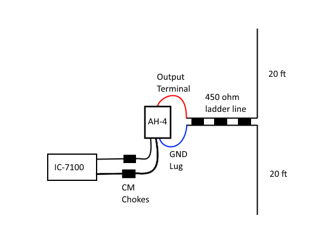
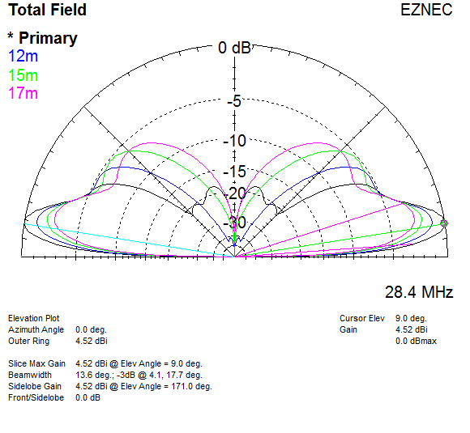
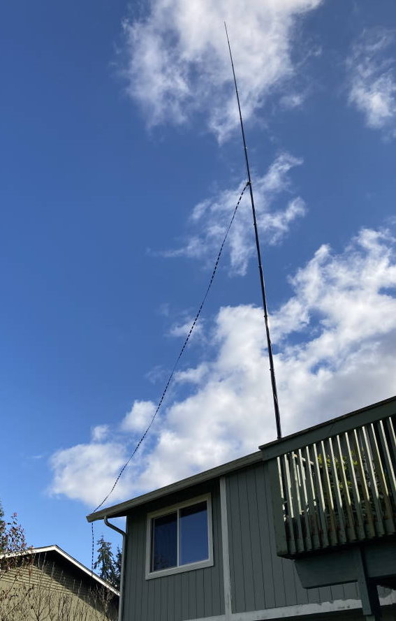
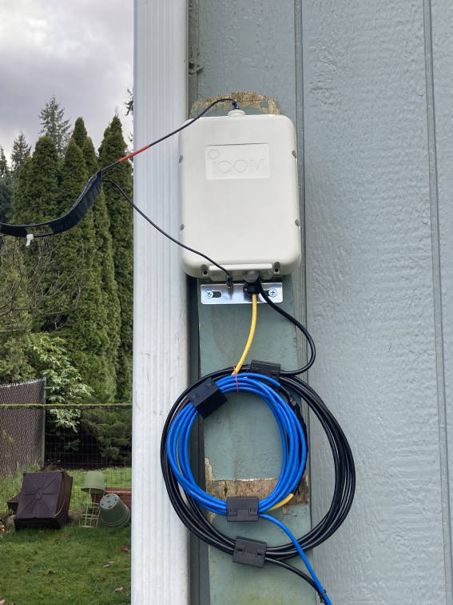

# 40 to 10m Vertical Doublet
40 ft center fed vertical.
450 ohm line to tuner, such as an AH-4.
40m through 10m operation.

2 x 5/8 on 10m (vertical EDZ), 4.5 dBi gain at 10 degrees when bottom wire is 10 ft above ground.
1/2 wave on 30m, should work "ok" on 40m.

Clean patterns with no high angle lobes!

For more info see [https://lonneys-notebook.blogspot.com/2021/03/40-ft-center-fed-vertical-40m-10m.html](https://lonneys-notebook.blogspot.com/2021/03/40-ft-center-fed-vertical-40m-10m.html).

Chokes, most (if not all) remote automatic antenna tuners are unbalacned, to feed a balanced antenna the tuner either needs to be floated above RF ground (per diagram), or ideally a high quality 1:1 current choke or ATU balun - after I switched to one of these from Balun Designs I got much better matches and an RFI issue on 17m went away.

Due to the potentially low impdeances presented on some bands a 4:1 is not recommended see [http://www.karinya.net/g3txq/tuner_balun/](http://www.karinya.net/g3txq/tuner_balun/).

\
`Antenna view:`
|  |
| - |

\
`Elevation plot 17m to 10m over average ground:`
|  |
| - |

\
`Elevation plot 40m to 20m over average ground:`
|  |
| - |

\
`Antenna mounted on 2nd level deck:`

\
`ATU and choke photo, these are 3/4" Mix 31 snap on:`

