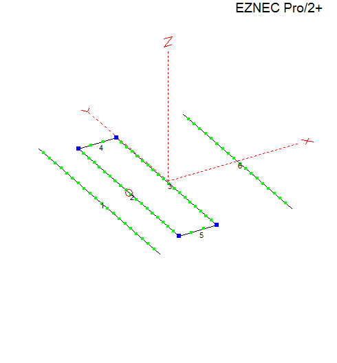
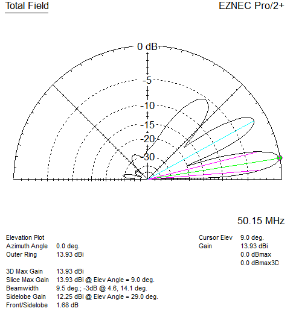
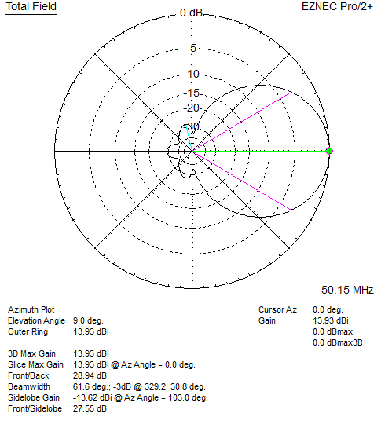
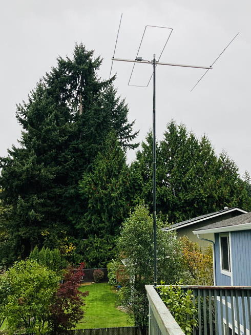
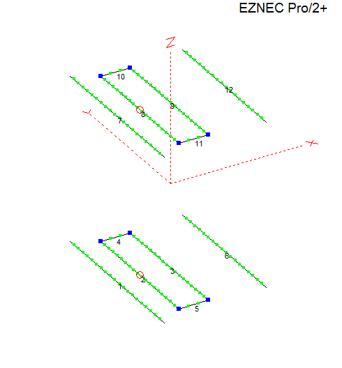
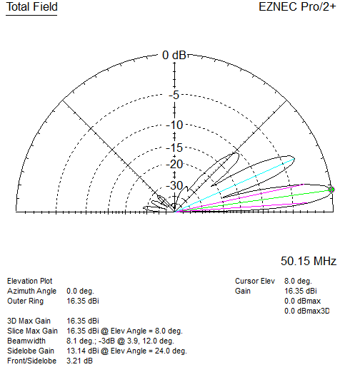
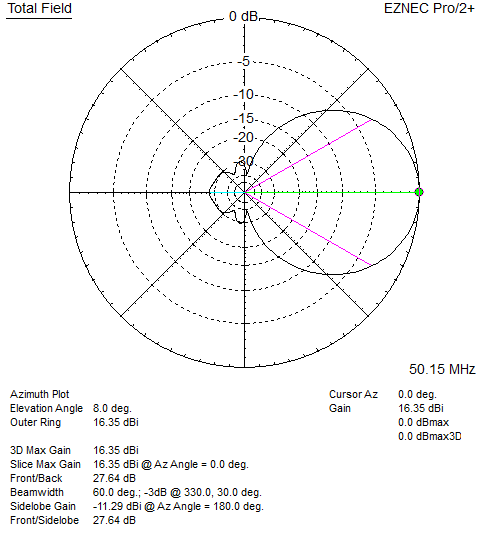

# 6m 3 Element LFA Yagi

LFA (Loop Fed Array) Yagis were developed by [G0KSC](https://www.g0ksc.co.uk/).

These are computer optimized, have direct 50 ohm feed and very clean patterns which help further improve the signal to noise ratio.

## 3 Element LFA
\
`Antenna View:`
|  |
| - |

\
`Elevation plot 10 meters / 30 ft height above average ground:`
|  |
| - |

\
`Azimuth plot 10 meters / 30 ft height above average ground:`
|  |
| - |

\
My 3 element LFA installed at 10 mH / 30 ft, from my Seattle location the 60 degree beam-width covers most of the US and South America when aimed South East. Rotation is manual and the wider beam-width makes aiming less critical.

With this antenna and 100W during [2022 E-season](https://lonneys-notebook.blogspot.com/2022/09/first-year-on-6-meters.html) (my first year on 6m) I worked most US states, and several countries using FT8 weak signal mode.
\
\

## 3 Element LFA Stack

Stacking increases gain by surpressing the higher angle lobes and "pushing" that energy into the lower main lobe, maintaines the same beam-width of 60 degrees.

Model uses minimum 1/2 wave stacking distance, peak gain is at 1.25 wavelength stacking distance.

Model does not include the transmission line phasing harness. These can be calculated and added to the model using transmission lines and virtual connections.

\
`Antenna View:`
|  |
| - |

\
`Elevation plot 10 meters / 30 ft height above average ground:`
|  |
| - |

\
`Azimuth plot 10 meters / 30 ft height above average ground:`
|  |
| - |